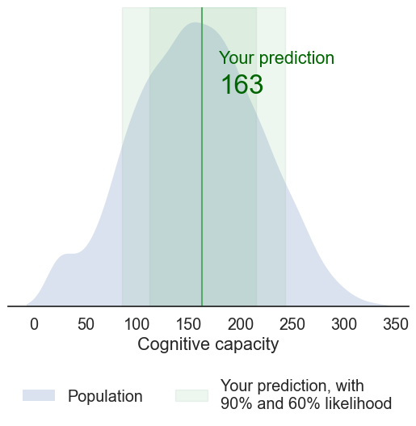
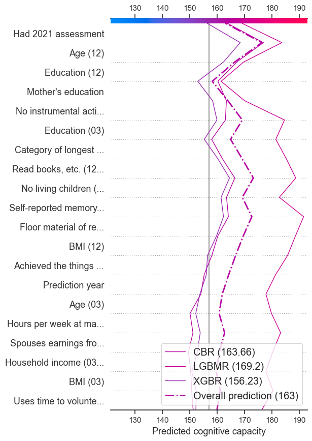
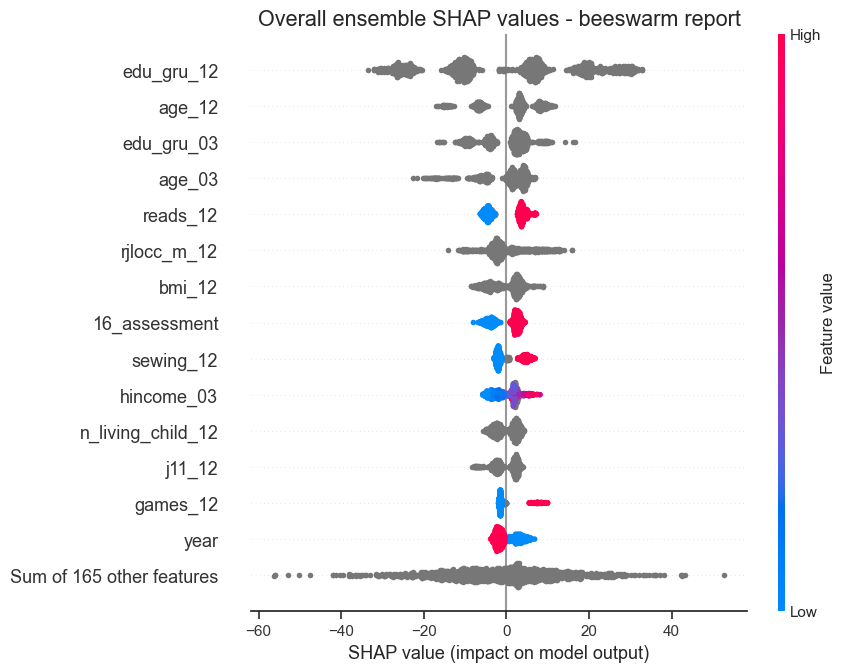

# Solution - PREPARE Challenge

Submission for "PREPARE: Pioneering Research for Early Prediction of Alzheimer's and Related Dementias EUREKA Challenge"
https://www.drivendata.org/competitions/group/nih-nia-alzheimers-adrd-competition/

Author: Nick Nettleton ([LinkedIn](https://www.linkedin.com/in/nicknettleton/), [GitHub](https://github.com/nicknettleton))

Username: [NickNettleton](https://www.drivendata.org/users/NickNettleton/) 

Team: Nick & Ry

Licence: MIT

## Summary

The main model is an ensemble of [LightGBM](https://lightgbm.readthedocs.io/en/stable/), [XGBoost](https://xgboost.ai/) and [CatBoost](https://catboost.ai/) regressors implemented in a [VotingRegressor](https://scikit-learn.org/stable/modules/generated/sklearn.ensemble.VotingRegressor.html). The hyperparameters were optimized using [Optuna](https://optuna.org/).

A [MapieRegressor](https://mapie.readthedocs.io/) is fitted to estimate prediction intervals, and [SHAP](https://shap.readthedocs.io/) is used to generate individual and population level explanations of the predictions.

Finally, we create visualizations to bring the data to life for lay users, providing them with meaningful context and intuition about their individual predictions and the underlying factors.

## Setup

The project structure is based on https://github.com/drivendataorg/prize-winner-template/ and https://cookiecutter-data-science.drivendata.org/.

1. Create Python 3.12.4 environment using ``make``.

```
cd path/to/this/directory
make create_environment
```

2. Follow on-screen instructions to activate the environment, e.g.:

```
source activate nr_prepare
```

3. Install the required Python packages - these are listed in  [requirements.txt](requirements.txt). (More recent  versions of XGBoost will give slightly different predictions, and the slightly out-of-date scikit-learn 1.5.2 is needed for compatibility with  XGBoost 2.1.2.)

```
make requirements
```

4. Copy the competition data into ``data/raw``:

    - train_features.csv
    - train_labels.csv
    - test_features.csv
    - submission_format.csv

5. To skip training, copy the [model weights](https://drive.google.com/drive/folders/14qreX7DhszHf58PJsGl3NKiU1nsmlXBr) to ``models/model.pkl``

6. To use the the Jupyter notebook [``examples.ipynb``](notebooks/examples.ipynb) with this environment:

```
pip install --user ipykernel
python -m ipykernel install --user --name=nr_prepare
````

And select nr_prepare as the kernel in Jupyter.

###  Expected file structure before inference or training is run

```
submission
├── data
│   ├── processed       <- The final predictions
│   └── raw             <- The original, immutable data dump
│       ├── submission_format.csv
│       ├── test_features.csv
│       ├── train_features.csv
│       └── train_labels.csv
├── models
│   └── model.pkl       <- Required for inference
├── notebooks
│   └── examples.ipynb  <- Example Python implementation
├── src                 <- Source code for use in this project
│   ├── __init__.py
│   ├── defaults.py
│   ├── predict.py
│   ├── prepare_data.py
│   ├── train.py
│   └── visualise.py
├── Makefile            <- Makefile with commands like `make requirements`
├── README.md           <- This README file
├── requirements.txt    <- The requirements file for reproducing the analysis environment
└── setup.py           
```

## Hardware

The solution was run on a MacBook Air M1 with macOS Sequoia 15.0 and 8GB memory. Both training and inference were run on CPU.

- Training time: ~3m 10s
- Inference time: ~3s

## Run training

The model can be trained from the command line or in Python. 

### Command line training

To run training from the command line: ``python src/train.py``.

```
$ python src/train.py --help
Usage: train.py [OPTIONS]

Options 
  --features-path           PATH    Path to the raw training dataset for processing
                                    [default: data/raw/train_features.csv]
  --labels-path             PATH    Path to the training labels
                                    [default: data/raw/train_labels.csv]
  --model-save-path         PATH    Path to save the trained model weights
                                    [default: models/model.pkl]
  --cv                              Cross validate on training dataset and report RMSE before training
                                    [default: no-cv]                                       
  --cv-predict                      Generate predictions from cross validation and save before training
                                    [default: no-cv-predict]
  --cv-predictions-path     PATH    Path to save predictions from cross validation
                                    [default: data/processed/cv_predictions.csv]
  --debug                           Run on a small subset of the data for debugging
                                    [default: no-debug]
 --help                             Show this message and exit.
```

### Python training

To train the model in Python:

```python
from src.train import train
train(
    features_path = train_features_path,
    labels_path = train_labels_path,
    model_save_path = model_save_path,
);
```

See [``examples.ipynb``](notebooks/examples.ipynb) for a full example.

### Model weights

Model weights are saved to ``model_save_path``, which is ``models/model.pkl`` by default. The file is ~90MB.

Model weights can be downloaded from https://drive.google.com/drive/folders/14qreX7DhszHf58PJsGl3NKiU1nsmlXBr.

You can use ``wget`` to download the model weights programmatically:

```
wget --no-check-certificate 'https://drive.google.com/file/d/1e7AUP_NItYEBWIX_lJJie7W_a75eexJf/view?usp=drive_link' -O models/model.pkl
```

###  Other notes

No network access or open-source downloads are required for training.

## Run inference

You can run inference from the command line or in Python. 

### Command line

To run inference from the command line: ``python src/predict.py``.

```
$ python src/predict.py --help
Usage: predict.py [OPTIONS]

Options:
  --model-path                PATH      Path to the saved model weights
                                        [default: models/model.pkl]
  --features-path             PATH      Path to the test features
                                        [default: data/raw/test_features.csv]
  --submission-save-path      PATH      Path to save the generated submission
                                        [default: data/processed/test_predictions.csv]
  --submission-format-path    PATH      Path to the submission format csv
                                        [default: data/raw/submission_format.csv]
  --include-mapie                       Include MAPIE intervals in the submission
                                        [default: no-include-mapie]
  --debug                               Run on a small subset of the data for debugging
                                        [default: no-debug]
  --help                                Show this message and exit.
```

Predictions are saved to ``submission_save_path``, which is ``data/processed/test_predictions.csv`` by default.
The output includes  prediction intervals if ``--include-mapie`` was used.

SHAP values are not currently saved out by the command line inferface, but can be accessed through the Python interface.

### Python

To run inference in Python:

```python
from src.predict import predict
predict(
    model_path = model_save_path,
    features_path = test_features_path,
    submission_save_path = test_predictions_path,
    submission_format_path = submission_format_path
);
```

To get labels, predictions intervals and SHAP explanation objects that you can work with in Python:

```python
labels, ensemble_explanation, subestimator_explanations = predict(
    model_path = model_save_path,
    features_path = test_features_path,
    submission_save_path = test_predictions_with_mapie_path,
    submission_format_path = submission_format_path,
    include_mapie = True,
    debug = False
)
```

Predictions are saved to ``submission_save_path``, which is ``data/processed/test_predictions.csv`` by default. The file includes  prediction intervals if ``include_mapie = True``.

Again, see [``examples.ipynb``](notebooks/examples.ipynb) for a full example

## Explainer charts

SHAP values and plots are not saved directly. Instead they can be created and manipulated in Python:

### Plot individual explainer charts
```python
from src.visualise import visualise_prediction, visualise_decision

# the index of the prediction to visualise
index = 0

# show the prediction and prediction intervals chart
plt = visualise_prediction(labels.loc[index], train_labels_path, show=False)
plt.show()

# show the SHAP decision plot
visualise_decision(index, ensemble_explanation, subestimator_explanations, show=False)
plt.show()
```

  


### Plot an overall ensemble explanation beeswarm

```python
import shap

shap.plots.beeswarm(ensemble_explanation, max_display=15, show=False)
plt.title('Overall ensemble SHAP values - beeswarm report')
plt.show()
```



 See [``examples.ipynb``](notebooks/examples.ipynb) for more examples.